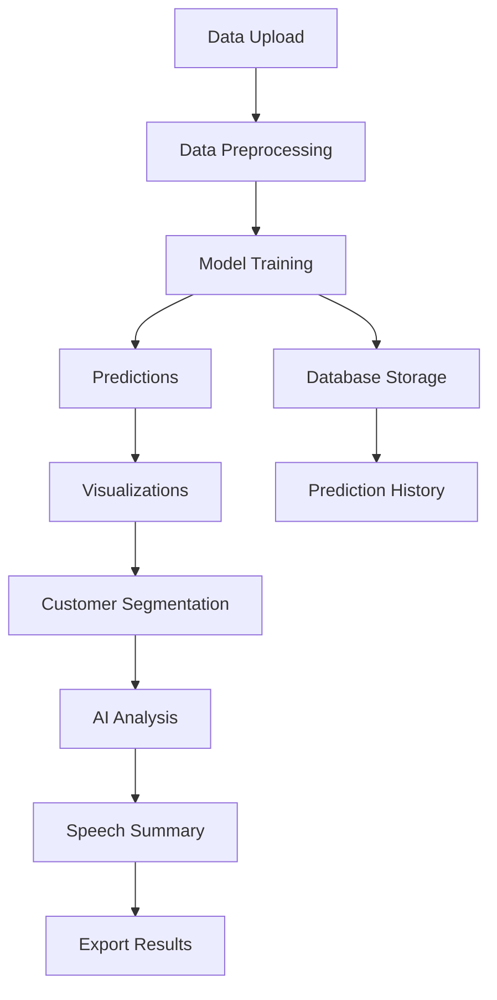

# Customer Churn Prediction Application

## Developer
Developed by S.Tamilselvan

## Project Overview
This application predicts customer churn using advanced machine learning algorithms and provides comprehensive analytics tools for business insights. It helps businesses identify customers at risk of leaving and provides actionable insights for retention strategies.



## Key Features

### 1. Data Management
- Secure data upload interface
- Automated data preprocessing
- Intelligent handling of missing values
- Feature engineering capabilities

### 2. Machine Learning Models
- Random Forest Classifier
- Logistic Regression
- Gradient Boosting
- Model performance tracking
- Cross-validation support

### 3. Advanced Analytics
- Interactive visualizations
- Customer segmentation (RFM Analysis)
- Demographic analysis
- Trend identification
- Feature importance analysis

### 4. AI-Powered Insights
- Automated pattern recognition
- Natural language summaries
- Strategic recommendations
- Risk factor identification

### 5. Export & Reporting
- PDF report generation
- CSV data export
- Interactive dashboards
- Custom visualization options

## Technical Architecture

### Frontend (Streamlit)
```
├── Data Upload Interface
├── Model Training Controls
├── Interactive Visualizations
├── Customer Segmentation Tools
└── Export Options
```

### Backend (Python)
```
├── Data Processing (utils.py)
├── ML Models (churn_prediction.py)
├── Database Operations (database.py)
└── Export Utilities (export_utils.py)
```

### Database (SQLite)
```
├── User Data
├── Predictions
├── Model Metrics
└── Customer Segments
```

## Security Features
- User authentication system
- Secure data storage
- Encrypted database
- Session management
- Access control

## Performance Metrics
- Real-time model accuracy tracking
- Prediction history logging
- Segmentation effectiveness metrics
- System response time monitoring
- Resource utilization tracking

## Getting Started

1. **Login/Signup**: Create an account or login to access the application
2. **Data Upload**: Upload your customer dataset in CSV format
3. **Model Selection**: Choose from available ML models
4. **Training**: Train the model on your dataset
5. **Analysis**: Explore insights through visualizations
6. **Export**: Generate reports and export predictions

## Best Practices
- Regularly update your dataset
- Monitor model performance
- Review AI-generated insights
- Export and backup predictions
- Use segmentation for targeted strategies

## Future Roadmap
1. Advanced ML algorithms integration
2. Real-time prediction capabilities
3. Enhanced visualization options
4. API integration features
5. Automated reporting system
6. Multi-language support

## Technical Stack
- **Frontend**: Streamlit
- **Backend**: Python 3.11
- **Database**: SQLite
- **ML Libraries**: scikit-learn, pandas, numpy
- **Visualization**: Plotly, Matplotlib, Seaborn
- **Export Tools**: FPDF, ReportLab

## System Requirements
- Python 3.11+
- Modern web browser
- Internet connection
- Minimum 4GB RAM
- Storage space for data

## Support
For technical support and inquiries:
- Developer: S.Tamilselvan
- Documentation: Available in-app
- Updates: Regular feature and security updates

## License
This project is protected under appropriate licensing terms. All rights reserved.

---
*Last Updated: 2024*
